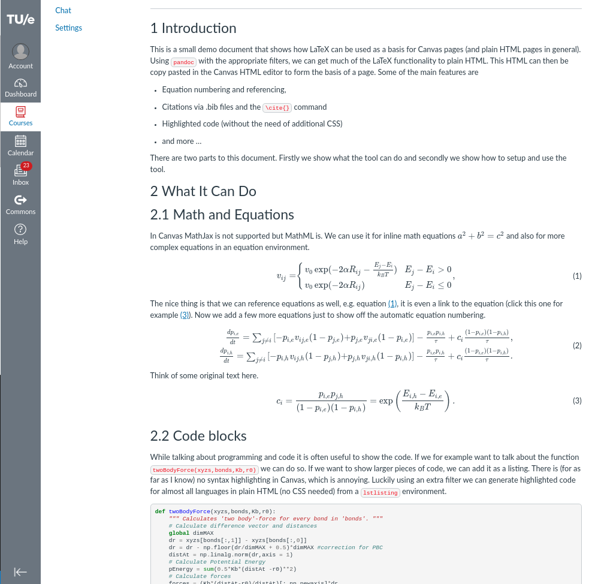

# Latex To Canvas LMS Pages
This tool converts LaTeX (.tex) files to plain HTML that can be used as a basis for pages in Canvas LMS.

Some of the features 

* Syntax highlighting for code
* Equation numbers and referencing
* Automatic table of contents

# Usage
The tool is made to be as easy as possible, to see what it can do run

```bash
./texToHtml.py input.tex
```
or on windows
```bash
python3 texToHtml.py input.tex
```

This will create a html page called `output.html`, the contents of this file can be copy pasted in the HTML editor of a Canvas page or viewed in a browser (NB in the last case not all features might work). The generated page will give a more detailed explanation of what the tool can do and how to customize the output.

### Example output (page fragment)


# Dependencies and Install
The tool is made in python and based around pandoc, hence a working python version is necessary. Pandoc can be installed via this [link](https://pandoc.org/installing.html), there is an installer, but also instructions for how to do it via the command line.
	
The syntax highlighting and equation numbering depend on two other python packages `pandocfilters` and `pygments`. They can be installed with `pip3 install <package_name>`

### For Windows Users
Start off by installing [pandoc](https://pandoc.org/installing.html). Just follow the installer instructions.

Next open a powershell, type `python` and press enter. If python is installed it will open and you can exit again, type `exit()` followed by an enter. If python is not installed it will lead you to the microsoft store where you can get/download it, press the button and let windows do the rest. 

Now that we have python installed return to the powershell and type `pip3 install pandocfilters` press enter and repeat for `pip3 install pygments`.

Next navigate (in powershell with `cd`) to the folder where the files of this repository are and type `python3 texToHtml.py input.tex` and press enter. An html file called `output.html` is now created copy paste it in the HTML editor of a Canvas page and that is all.


## Files
Every pandoc filter and template has its own file, these files should be accessible to the program while running. The easiest way to achieve this is by putting them in the working directory. The files needed are	
* `highlightCode.py` provides syntax highlighting
* `addEquationNumbers.py` provides equation numbers
* `canvasTemplate.html` provides a template for the page we generate. In the example template I have used it to set the width of the page to 900 pixels.
